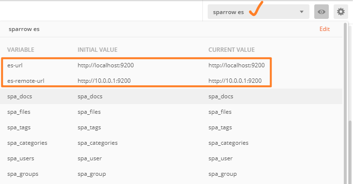
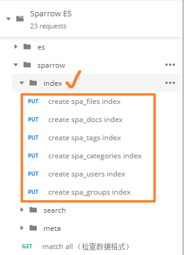

## 0.环境准备

### 0.1.Elasticsearch

#### 0.1.1.Elasticsearch 7.2.0

1. 官方安装文档：[Elasticsearch Reference 7.2.0 / Getting Started Installation](https://www.elastic.co/guide/en/elasticsearch/reference/7.2/getting-started-install.html)

2. 为ES安装smartcn中文分词插件：

```bash
# cmd / terminal
# dir: elasticsearch-7.2.0/bin/
# desc: 使用 `elastic-plugin` 安装smartcn插件
./elasticsearch-plugin install analysis-smartcn
```

#### 0.1.2.Postman测试运维脚本

0. 安装 [postman](https://www.getpostman.com/)

1. 将 [Sparrow ES.postman_collection.json](./ES.postman_collection.json) 导入postman

	> 如果导入出错，请升级postman版本（Postman v7.3.3）


2. 创建测试环境 `sparrow es` （命名随意）

   * 添加环境变量 `es-url` 与 `es-remote-url`

   > 请将 es-url 和 es-remote-url 修改为实际开发、生产环境中ES的ip地址与对应端口号

    

    * 添加sparrow索引的环境变量：

      > 请将具体命名相应地更改为实际开发、生产环境中索引的命名

      


#### *0.1.3.Logstash 7.2.0 [可选]

运维开发工具，用于ES数据导入、迁移：[Installing Logstash](https://www.elastic.co/guide/en/logstash/7.2/installing-logstash.html)

####  *0.1.4.Elasticdump [可选]

轻量级ES数据导入导出工具。

1. 安装 [nodejs环境](https://nodejs.org/en/)

2. 使用npm命令安装 [elasticdump工具](https://github.com/taskrabbit/elasticsearch-dump)

```bash
# cmd / terminal
# desc: 使用npm命令安装elasitcdump工具
npm install -g elasticdump
```


## 1.数据准备

### 1.1.ES数据准备

#### 1.1.1.创建索引映射

sparrow用以下6个索引存储相关Meta信息：

| 索引           | 简介            |
| -------------- | --------------- |
| spa_docs       | sparrow文档Meta |
| spa_files      | sparrow文件Meta |
| spa_tags       | 标签            |
| spa_categories | 类目            |
| spa_users      | 用户            |
| spa_groups     | 群组            |

>  相应的字段设计具体见 《ES Meta&检索-技术方案》

使用Postman： `Sparrow ES/sparrow/index` 创建索引映射。

> 注：如果缺失ES的smartcn插件，会抛出异常！



检查ES索引状态：


#### *1.1.2.迁移业务数据

创建索引后，sparrow系统初始化，没有数据。可以考虑从原有业务数据库中将Meta数据（文档、文件以及标签等）迁移到ES。这里以mysql为例，使用logstash将关系型数据迁移到ES。

##### A.迁移文件Meta


#### *1.1.3.备份与恢复数据

##### A.备份与恢复ES集群

ES官方文档 [Back up a Cluster](https://www.elastic.co/guide/en/elasticsearch/reference/7.2/backup-cluster.html)

##### B.备份与恢复少量数据

使用elasticdump工具备份、恢复数据。

> 留意命令行工作目录、Elasticsearch主机和端口号

* 备份数据：

```bash
# cmd / terminal
# dir: 文件所在目录
elasticdump --output=spa_files.json --input=http://localhost:9200/spa_files
elasticdump --output=spa_docs.json --input=http://localhost:9200/spa_docs
elasticdump --output=spa_tags.json --input=http://localhost:9200/spa_tags
elasticdump --output=spa_categories.json --input=http://localhost:9200/spa_categories
```

* 恢复数据：

```bash
# cmd / terminal
# dir: 文件所在目录
elasticdump --input=spa_files.json --output=http://localhost:9200/spa_files
elasticdump --input=spa_docs.json --output=http://localhost:9200/spa_docs
elasticdump --input=spa_tags.json --output=http://localhost:9200/spa_tags
elasticdump --input=spa_categories.json --output=http://localhost:9200/spa_categories
```


## 2.代码配置

### 2.1.后端代码配置

#### 2.1.1.ES配置

1. 配置ES的ip地址与端口号
2. 指定sparrow使用的6个ES索引

```yaml
elasticsearch-config:
  host: localhost
  port: 9200
  indices:
    doc: spa_docs
    file: spa_files
    tag: spa_tags
    category: spa_categories
    group: spa_group
    user: spa_user
```


