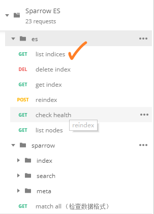

## 0.环境准备

### 0.1.Elasticsearch

#### 0.1.1.Elasticsearch 7.2.0

1. 官方安装文档：[Elasticsearch Reference 7.2.0 / Getting Started Installation](https://www.elastic.co/guide/en/elasticsearch/reference/7.2/getting-started-install.html)

2. 为ES安装smartcn中文分词插件：

```bash
# cmd / terminal
# dir: elasticsearch-7.2.0/bin/
# desc: 使用 `elastic-plugin` 安装smartcn插件
./elasticsearch-plugin install analysis-smartcn
```

#### 0.1.2.Postman测试运维脚本

0. 安装 [postman](https://www.getpostman.com/)

1. 将 [Sparrow ES.postman_collection.json](./ES.postman_collection.json) 导入postman

	> 如果导入出错，请升级postman版本（Postman v7.3.3）


2. 创建测试环境 `sparrow es` （命名随意）

   * 添加环境变量 `es-url` 与 `es-remote-url`

   > 请将 es-url 和 es-remote-url 修改为实际开发、生产环境中ES的ip地址与对应端口号

    

    * 添加sparrow索引的环境变量：

      > 请将具体命名相应地更改为实际开发、生产环境中索引的命名

      


#### *0.1.3.Logstash 7.2.0 [可选]

运维开发工具，用于ES数据导入、迁移：[Installing Logstash](https://www.elastic.co/guide/en/logstash/7.2/installing-logstash.html)

####  *0.1.4.Elasticdump [可选]

轻量级ES数据导入导出工具。

1. 安装 [nodejs环境](https://nodejs.org/en/)

2. 使用npm命令安装 [elasticdump工具](https://github.com/taskrabbit/elasticsearch-dump)

```bash
# cmd / terminal
# desc: 使用npm命令安装elasitcdump工具
npm install -g elasticdump
```


## 1.数据准备

### 1.1.ES数据准备

#### 1.1.1.创建索引映射

sparrow用以下6个索引存储相关Meta信息：

| 索引           | 简介            |
| -------------- | --------------- |
| spa_docs       | sparrow文档Meta |
| spa_files      | sparrow文件Meta |
| spa_tags       | 标签            |
| spa_categories | 类目            |
| spa_users      | 用户            |
| spa_groups     | 群组            |

>  相应的字段设计具体见 《ES Meta&检索-技术方案》

使用Postman： `Sparrow ES/sparrow/index` 创建索引映射。

> 注：如果缺失ES的smartcn插件，会抛出异常！


检查ES索引状态：



#### *1.1.2.迁移业务数据

创建索引后，sparrow系统初始化，没有数据。可以考虑从原有业务数据库中将Meta数据（文档、文件以及标签等）迁移到ES。这里以mysql为例，使用logstash将关系型数据迁移到ES。

1. 导入示例数据到mysql：

```bash
# 命令行登录mysql
> mysql -uroot -p123456

# 留意legal.sql所在目录
mysql > created database legal character set utf8mb4;
mysql > source legal.sql;
```

示例数据库中表格信息与ES索引对应如下：

| mysql表格                    | 包含信息               | ES索引                       | logstash迁移配置文件 |
| ---------------------------- | ---------------------- | ---------------------------- | -------------------- |
| file_t                       | 文件Meta               | spa_files                    | spa_files.yml        |
| category_t                   | 类目                   | spa_categories               | spa_categories.yml   |
| keyword_t                    | 关键词                 | spa_tags                     | spa_tags.yml         |
| file_category_t              | 文件与类目的外联关系   | spa_files 的 categories 字段 | file_categories.yml  |
| file_keyword_t               | 文件与关键词的外联关系 | spa_files 的 tags 字段       | file_tags.yml        |
| keyword_t<br/>file_keyword_t | 关键词                 | spa_files 的 keywords 字段   | file_keywords.yml    |

2. 迁移文件Meta

从 mysql  `file_t` 表迁移数据到ES `spa_file` 索引，查询语句如下：

```mysql
select concat('image_', `id`) as `id`,
	concat('image_', `id`) as `original_id`,
	`title`,
	`desc`,
	`creator`,
	`content`,
	
	-- 转换时间格式
	date_format(str_to_date(`created_time`, '%Y/%m/%d %H:%i'), get_format(DATETIME, 'JIS')) as `created_time`,
	date_format(str_to_date(`modified_time`, '%Y/%m/%d %H:%i'), get_format(DATETIME, 'JIS')) as `modified_time`,

	'image' as `type`,
	CASE FLOOR(RAND() * 3)
		WHEN 0 THEN 'jpg'
		WHEN 1 THEN 'png'
		WHEN 2 THEN 'gif'
	END as `ext`,

	-- 赋予字段初始值（也可省略这些字段）
	1024 as `size`, 
	NULL as `store_key`,
	NULL as `thumbnail`, 
	NULL as `derived_files`,
	NULL as `doc_id`,
	0 as `version`,
	NULL as `parent_id`
from `file_t`;
```

将查询语句写入 `spa_files.yml` 配置文件，使用logstash迁移数据：

>  修改 `spa_files.yml` 文件中的数据库配置（用户名、密码、驱动等）、以及对应的ES索引

```bash
# dir: sparrow/doc/logstash/
./logstash -f spa_files.yml
```

用类似的方法，将 `category_t` 与 `keyword_t` 分别迁移到 `spa_categories` 和 `spa_tags` 索引。

3. 迁移文件外联字段

从 mysql  `file_keyword_t` 表迁移标签id的数据到ES `spa_file` 索引，查询语句如下：

```mysql
SELECT concat('image_', F.id) as `id`, `keyword_id` as tag_id
FROM (select `id` from `file_t`) as F join `file_keyword_t` as FT on F.id = FT.file_id
order by F.id;
```

得到按 (`id`, `tag_id`) 的一条条记录，按 `id` 排序。

使用 `file_tags.yml` 配置文件迁移数据：

```bash
# dir: sparrow/doc/logstash/
# 使用单线程，保证同一id对应的多个tag_id能按次序收集到tags数组中
./logstash -f file_tags.yml -w 1
```

用类似的方法，迁移 `file_category_t` 的数据到 `spa_files` 的 `categories` 字段。

4. 迁移文件关键词

方法类似[3.迁移外联字段]

```mysql
SELECT concat('image_', F.id) as `id`, K.`keyword` as `keyword`
FROM (select `id` from `file_t`) as F 
    join `file_keyword_t` as FT on F.id = FT.file_id
    join `keyword_t` as K on FT.keyword_id = K.id
order by F.id;
```

```bash
# dir: sparrow/doc/logstash/
# 使用单线程，保证同一id对应的多个keyword能按次序收集到keywords数组中
./logstash -f file_keywords.yml -w 1
```

5. 检测索引状态与数据格式


#### *1.1.3.备份与恢复数据

##### A.备份与恢复ES集群

ES官方文档 [Back up a Cluster](https://www.elastic.co/guide/en/elasticsearch/reference/7.2/backup-cluster.html)

##### B.备份与恢复少量数据

使用elasticdump工具备份、恢复数据。

> 留意命令行工作目录、Elasticsearch主机和端口号

* 备份数据：

```bash
# cmd / terminal
# dir: 文件所在目录
elasticdump --output=spa_files.json --input=http://localhost:9200/spa_files
elasticdump --output=spa_docs.json --input=http://localhost:9200/spa_docs
elasticdump --output=spa_tags.json --input=http://localhost:9200/spa_tags
elasticdump --output=spa_categories.json --input=http://localhost:9200/spa_categories
```

* 恢复数据：

```bash
# cmd / terminal
# dir: 文件所在目录
elasticdump --input=spa_files.json --output=http://localhost:9200/spa_files
elasticdump --input=spa_docs.json --output=http://localhost:9200/spa_docs
elasticdump --input=spa_tags.json --output=http://localhost:9200/spa_tags
elasticdump --input=spa_categories.json --output=http://localhost:9200/spa_categories
```


## 2.代码配置

### 2.1.后端代码配置

#### 2.1.1.ES配置

在application.yml配置文件中：

1. 配置ES的ip地址与端口号
2. 指定sparrow使用的6个ES索引

```yaml
elasticsearch-config:
  host: localhost
  port: 9200
  indices:
    doc: spa_docs
    file: spa_files
    tag: spa_tags
    category: spa_categories
    group: spa_group
    user: spa_user
```


