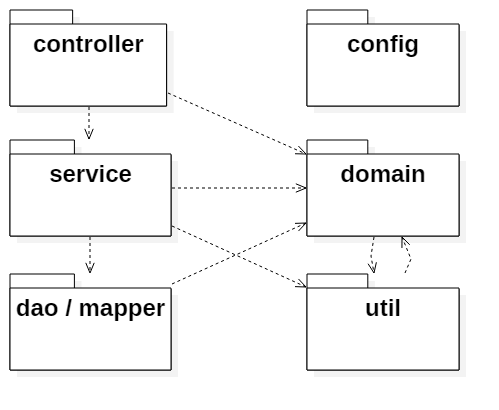

# 后端代码框架

[TOC]

## 1.技术栈

| 技术                                | 作用                                |
| ----------------------------------- | ----------------------------------- |
| spring boot                         | 后端框架                            |
| elasticsearch                       | ES Meta管理与检索                   |
| postgresql                          | 业务数据库                          |
| mybatis                             | 数据映射ORM框架，用于访问业务数据库 |
| redis                               | redis数据库                         |
| swagger ui                          | controller层API接口测试             |
| eventbus                            | 同步消息，发布者订阅者模式          |
| rabbitmq                            | 异步消息队列                        |
| fastjson                            | java对象与json的转换                |
| spring security                     | 暂时只用于拦截swagger ui的相关url   |
| spring boot configuration processor | 将yml配置读取为Java配置类           |
| lombok                              | 简化pojo的getter, setter方法等      |
|                                     |                                     |
|                                     |                                     |
|                                     |                                     |

> 这里只列出重要的技术，具体细节见 pom.xml 文件中的依赖项

// TODO: 文件管理相关的依赖

## 2.代码结构

```lua
-- 代码包结构
src/main/java/com/micerlab/sparrow/
├── config -- 配置类等
├── controller -- 控制器（API）
├── service -- 服务层（业务逻辑）
├── dao -- 数据持久化层
|	├── es -- elasticsearch
|	└── postgre -- postgre业务数据库
|
├── mapper --  业务数据库SQL映射文件
├── domain -- 领域层（业务逻辑所需的类等）
├── utils -- 封装的工具类
├── message -- 消息事件
	├── amqp -- rabbitmq消息队列（异步）
	└── eventbus -- eventbus（同步）

-- 配置文件
src/main/resources/
├── application.yml -- springboot配置文件
├── logback-spring.yml -- 日志配置文件
├── hanlp.properties -- hanlp自然语言处理配置
├── static -- 静态资源
	└── type_exts -- 拓展名配置文件
```

## 3.关键技术实现

#### A.业务逻辑层包结构



业务逻辑主要采用3层结构：

1. controller响应HTTP请求，调用service层的服务处理请求，为前端提供API服务。
2. service层调用dao层的接口读写数据库，配合domain层的实体类与util层提供的工具类，完成业务逻辑的处理。
3. dao层负责将数据库中的关系型记录与内存中的Java对象之间的映射，完成数据库的请求。

#### B.异常处理

异常处理有助于构建强壮性软件，提供软件抵抗错误输入的能力，同时有助于前后端开发者在开发中快速定位bug。异常处理的实现主要依赖于`ErrorCode`, `BusinessException`, `GlobalDefaultExceptionHandler`, `ErrorResult`4个类：


##### B1.ErrorCode：自定义错误码

在ErrorCode枚举类中定义各种开发过程中的常见的错误：

```java
package cn.edu.scut.bookshop.domain;

import org.springframework.http.HttpStatus;

/**
 * 自定义错误状态码
 * 规范设计，便于统一管理
 */
public enum ErrorCode
{
    // 400 BadRequest 参数错误等
    BAD_REQUEST_COMMON(400_000, "Bad Request"),
//    PARAM_ERR_SEARCH_TYPE(400_001, "search_type ∈ {all, image, doc, video, audio, others}"),
    PARAM_ERR_SEARCH_TYPE(400_001, "search_type ∈ " + Arrays.asList(FileType.values()).toString()),
    PARAM_ERR_FILTER_TYPE(400_002, "filter_type ∈ {tag, category}"),
    PARAM_ERR_FILTER_TYPES(400_003, "filter_types ∈ {tags, categories}"),
    PARAM_ERR_REQUEST_DATA_FIELD_UNPASS(400_004, "请求数据字段验证不通过"),
    PARAM_ERR_REQUEST_DATA_REQUIRED_FIELD_IS_NULL(400_005, "请求数据必须字段不可为空"),
    PARAM_ERR_PARENT_ID_NOT_IN_DOC(400_006, "父版本文件不在指定文档下"),
    
    
    // 403 Forbidden 权限：未授权 / 非法访问
    FORBIDDEN_COMMON(403_000, "Forbidden"),
    FORBIDDEN_NO_WRITE_CUR_DIR(403_001, "用户对当前目录没有可写权限，无法进行该操作"),
    FORBIDDEN_NO_READ_CUR_DIR(403_002, "用户对当前目录没有可读权限，无法进行该操作"),
    FORBIDDEN_NO_WRITE_CUR_DOC(403_003, "用户对当前文档没有可写权限，无法进行该操作"),
    FORBIDDEN_NO_READ_CUR_DOC(403_004, "用户对当前文档没有可读权限，无法进行该操作"),
    FORBIDDEN_NO_READ_TARGET_RESOURCE(403_005, "用户对目标资源没有可读权限，无法进行该操作"),
    FORBIDDEN_NOT_GROUP_OWNER(403_006, "只有群主才有权限进行该操作"),
    FORBIDDEN_NOT_GROUP_MEMBER(403_007, "只有群成员才有权限进行该操作"),
    FORBIDDEN_NOT_RESOURCE_OWNER(403_007, "只有资源的创建者才有权限进行该操作"),
    // 404 Not Found
    NOT_FOUND_COMMON(404_000, "Not Found"),
    NOT_FOUND_USERNAME_OR_PASSWORD_INVALID(404_001, "用户不存在或密码错误"),
    NOT_FOUND_FILE_ID(404_002, "文件id不存在"),
    NOT_FOUND_DOC_ID(404_003, "文档id不存在"),
    NOT_FOUND_TAG_ID(404_004, "标签id不存在"),
    NOT_FOUND_CATEGORY_ID(404_005, "类目id不存在"),
    NOT_FOUND_FILE_IN_DOC(400_006, "文件不在指定文档内"),
    
    
    // 500 Internal Server Error 服务器错误
    SERVER_EXCEPTION(500_000, "服务器发生异常"),
    SERVER_ERR_DB(500_001, "数据库异常"),
    SERVER_ERR_ELASTICSEARCH(500_002, "Elasticsearch异常"),
    SERVER_ERR_OSS(500_003, "OSS错误调用"),
    SERVER_ERR_Minio(500_004, "Minio异常"),
    SERVER_ERR_RABBITMQ(500_005, "rabbitmq异常")
    
    ;
    
    private final int status;
    private final String msg;
    
    ErrorCode(int status, String msg)
    {
        this.status = status;
        this.msg = msg;
    }
    
    public int getStatus()
    {
        return status;
    }
    
    public String getMsg()
    {
        return msg;
    }
    
    /**
     * 获取相应的http状态码，用于设置返回response的status
     * @return 3位 http status
     */
    public int getHttpStatus()
    {
        HttpStatus status = HttpStatus.valueOf(getStatus() / 1000);
        return status.value();
    }
}
```

##### B2.BusinessException：业务异常类

BusinessException业务异常类封装了ErrorCode和具体的异常消息，在service层处理业务逻辑时，如果遇到异常情况（参数错误、数据库连接错误等），可直接抛出BusinessException而立刻终止业务逻辑。

##### B3.GlobalDefaultExceptionHandler：全局业务异常处理器

该控制器注册了全局异常处理，用来捕获所有抛出的BusinessException，将错误信息放入ErrorResult中，返回给前端。

##### B4.ErrorResult类：错误信息的JSON化

ErrorResult类包含了错误的状态码、简略错误信息与错误日志。

以下错误信息可帮助开发者快速定位到数据源的连接异常：

```json
{
  "status": 500002,
  "error": "Elasticsearch异常",
  "message": "Timeout connecting to [localhost/127.0.0.1:9200]"
}
```

#### C.跨域配置


#### D.Swagger-UI

Swagger-UI是一种基于Java代码自动构建API文档及API测试的技术。后端开发人员只需在Java代码的controller接口上添加少量注解，即可构建该接口的文档，并填入参数进行测试。基于Swagger-UI的测试，可融合【测试驱动开发】的开发过程，辅助开发。

启动后端项目后，用浏览器访问 http://localhost:8089/swagger-ui.html/ ，输入sparrow开发者的用户名和密码（application.yml），即可很方便地进行接口的测试。